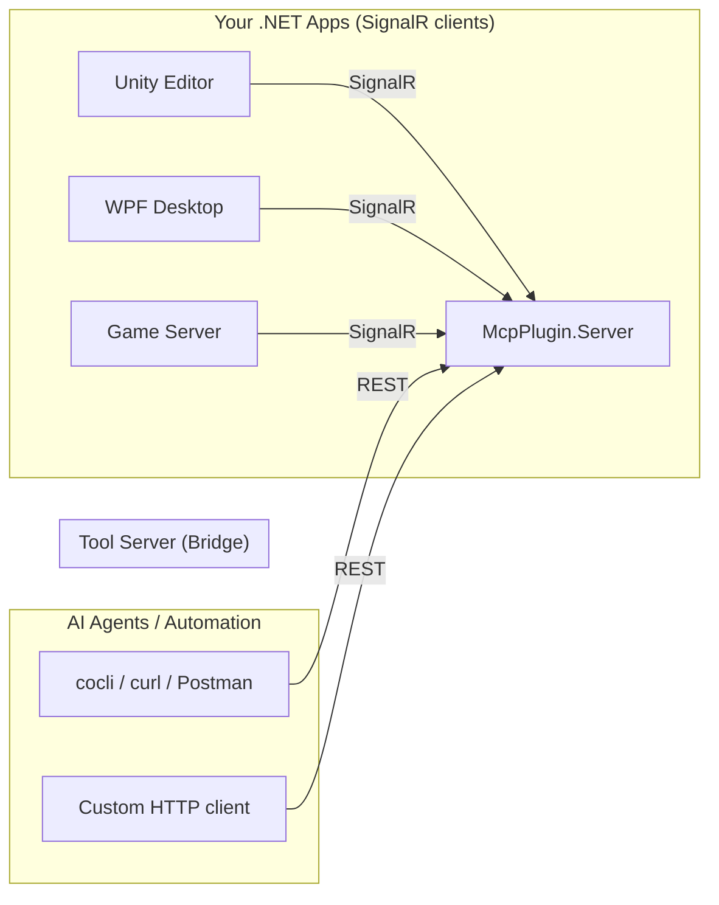

# Tool Server for .NET (fork of MCP-Plugin-dotnet)

[](https://github.com/IvanMurzak/MCP-Plugin-dotnet/blob/main/LICENSE)
[](https://stand-with-ukraine.pp.ua)

> ## Fork notice
>
> This is the **`unity-copilot` fork** of [`IvanMurzak/MCP-Plugin-dotnet`](https://github.com/IvanMurzak/MCP-Plugin-dotnet) 6.3.2.
>
> **The MCP protocol layer has been stripped.** The original upstream is an MCP bridge that exposes tools/prompts/resources to MCP clients (Claude Desktop, Cursor, etc.) via JSON-RPC. This fork removes that entire layer — the binary now exposes only:
>
> - **REST** (`/api/tools/{name}`, `/api/system-tools/{name}`, `/api/session*`, `/api/instances`) for AI agents and automation scripts to call via plain HTTP/JSON
> - **SignalR Hub** for `McpPlugin` clients (Unity Editor, WPF, game servers) to register tools and stay connected
>
> **No MCP clients can connect to this fork.** No `streamableHttp` transport, no stdio transport, no JSON-RPC envelope, no `tools/list` MCP handshake. Pure REST in, SignalR out.
>
> **Why**：upstream `IvanMurzak/MCP-Plugin-dotnet` has been forked permanently into the `unity-copilot` workspace to support Phase A (HTTP session isolation) and Phase B (cross-instance tool routing). With the fork already in place and 100% of traffic going through a CLI (cocli) that talks plain REST, the MCP protocol layer became dead code worth ~2,500 lines of C# + two NuGet packages. Stripping it reduced maintenance surface and simplified the Strategy abstraction. See `../docs/skills-vs-cli-strategy.md §15` for the full rationale.
>
> **This fork does not merge with upstream anymore.** If you need MCP client compatibility, use upstream `IvanMurzak/MCP-Plugin-dotnet` directly.

## Overview

**Tool Server for .NET** is a SignalR bridge that lets heavy .NET applications (Unity, WPF, game servers) expose tools to AI agents over plain HTTP/REST, without being spawned as subprocesses.

### The Problem: Independent Lifecycles

Standard tool servers are typically designed to be launched as subprocesses by the client. This works well for lightweight scripts but creates challenges for complex .NET applications like **Unity Engine**, **WPF Desktop Apps**, or **Game Servers**:

1. **Heavy Startup**: These applications are often too heavy to be spawned repeatedly by a client.
2. **Independent Lifecycle**: They often need to run independently (e.g., you are already working in the Unity Editor).
3. **Live Context**: You want to interact with the *currently running* instance (e.g., "Add a cube to the current scene"), not start a new, empty instance.

### The Solution: The Bridge Pattern

This project solves this by decoupling the AI agent from your application using a **Bridge Architecture**:

1. **McpPlugin (In-App)**: A lightweight library you add to your .NET application (e.g., Unity, WPF, Console). It connects to the bridge via **SignalR** and registers its tools.
2. **McpPlugin.Server (Bridge)**: A high-performance ASP.NET Core gateway. It exposes REST endpoints to the outside world and fan-outs to plugins via SignalR.

**Why SignalR (plugin-side)?**

- **Resilience**: Built-in automatic reconnection logic. If the bridge restarts, your app reconnects instantly.
- **Simplicity**: Operates over a single HTTP port. No complex firewall rules.
- **Bidirectional**: The bridge can invoke tools in your app, and your app can push updates (logs, progress) back to the bridge.

**Why REST (client-side, post-strip)?**

- **curl-friendly**: Any HTTP client (curl, Postman, language SDKs) can call tools — no JSON-RPC envelope, no SSE.
- **CLI-first**: AI-agent CLIs (cocli, etc.) call `POST /api/tools/{name}` directly with a single fetch.
- **Trivial to debug**: stdout/stderr/exit-code semantics survive end-to-end.

## Architecture

The system uses a hub-and-spoke architecture where `McpPlugin.Server` acts as the central gateway.



## Features

- **Attribute-Based Registration**: Easily expose tools using `[McpPluginTool]` (and `[McpPluginToolType]` on containing classes).
- **Powered by ReflectorNet**:
  - **Complex Type Support**: Seamlessly handle nested objects, collections, and custom types in tool parameters.
  - **Fuzzy Matching**: Tools can be called with partial names or slightly mismatched signatures.
  - **Automatic Schema Generation**: Precise JSON schemas are generated for your C# types and exposed via `GET /api/tools`.
- **Real-time Bidirectional Communication**: Uses SignalR for a persistent, low-latency link between your apps and the bridge.
- **REST API**: All tool calls happen via plain HTTP — no protocol envelope.
- **Session Gating & Instance Routing** (Phase A/B): per-session enabled-tools subsets, multi-instance fan-out via `Mcp-Session-Id` header. See REST endpoints below.
- **Dependency Injection**: First-class support for `Microsoft.Extensions.DependencyInjection`.
- **Assembly Scanning**: Automatically discover and register components from your entire project.

## REST endpoints

All endpoints accept and return JSON. `Authorization: Bearer <token>` is required when the server is started with `authorization=required`. Session-scoped endpoints honour the `Mcp-Session-Id` header (any opaque string — the client picks it).

### Tool invocation

| Method | Path | Purpose |
|---|---|---|
| `GET`  | `/api/tools`                  | List all registered tools with `inputSchema` / `outputSchema`. Honours per-session `EnabledTools` gating. |
| `POST` | `/api/tools/{name}`           | Invoke a tool by name with JSON args. Returns 403 if `name` is not in the session's `EnabledTools`. |
| `GET`  | `/api/system-tools`           | List system tools (ping, skills generation, etc.). |
| `POST` | `/api/system-tools/{name}`    | Invoke a system tool. |

### Session management (Phase A/B — new in this fork)

| Method   | Path                            | Purpose |
|----------|---------------------------------|---------|
| `GET`    | `/api/session`                  | Current session view: `{sessionId, enabledTools, activeInstanceId, ...}`. |
| `POST`   | `/api/session/enabled-tools`    | Body `{toolIds: string[]}`. Restrict this session to a subset. Empty array == open the gate (set to null). |
| `DELETE` | `/api/session/enabled-tools`    | Disable **every** tool for this session (only `/api/session/*` endpoints remain reachable; tool calls 403). |
| `GET`    | `/api/session/all`              | Administrator snapshot of every active session. |
| `POST`   | `/api/session/instance`         | Body `{instanceId: string}`. Pin this session to a specific connected plugin instance. |
| `DELETE` | `/api/session/instance`         | Clear the pin (fall back to default routing). |
| `GET`    | `/api/instances`                | List every currently-connected plugin instance. |

**Lazy-touch semantic**: a tool call refused by `EnabledTools` gating does **not** bump `SessionState.LastSeenUtc` — refused calls cannot keep an otherwise-idle session alive past the eviction threshold.

## Getting Started

### 1. The Server (`McpPlugin.Server`)

Host the bridge in an ASP.NET Core application:

```csharp
// Program.cs
using com.IvanMurzak.McpPlugin.Common;
using com.IvanMurzak.McpPlugin.Common.Utils;
using com.IvanMurzak.McpPlugin.Server;
using com.IvanMurzak.McpPlugin.Server.Api;

var builder = WebApplication.CreateBuilder(args);

// 1. Prepare arguments (or load from config)
var dataArguments = new DataArguments(args);

// 2. Register the Tool Server (replaces the legacy
//    .WithMcpServer(...).WithMcpPluginServer(...) chain — that API is gone)
builder.Services.AddToolServer(dataArguments);

// 3. Configure Kestrel with separate IPv4/IPv6 bindings (avoids dual-stack issues on macOS)
builder.WebHost.UseKestrelForMcpPlugin(dataArguments.Port);

var app = builder.Build();

// 4. Wire up middleware + endpoints in one call.
//    UseMcpPluginServer internally maps:
//      POST /api/tools/{name}, GET /api/tools
//      POST /api/system-tools/{name}, GET /api/system-tools
//      /api/session, /api/session/enabled-tools, /api/session/all
//      /api/session/instance, /api/instances
//    plus the SignalR hub used by plugin clients.
app.UseMcpPluginServer(dataArguments);

app.Run();
```

> The signature `AddToolServer(IServiceCollection, DataArguments, ...)` replaces the previous `.WithMcpServer(...).WithMcpPluginServer(...)` chain. `WithMcpServer(...)` no longer exists; `WithMcpPluginServer(IMcpServerBuilder, ...)` no longer exists. The new entry point takes an `IServiceCollection` (not an `IMcpServerBuilder`) because there is no longer any `ModelContextProtocol` SDK to chain off.

### 2. The Client App (`McpPlugin`)

Add the `McpPlugin` package to your .NET application.

**Defining Tools:**

```csharp
using com.IvanMurzak.McpPlugin;
using System.ComponentModel;

[McpPluginToolType]
public static class MyComponents
{
    [McpPluginTool("calculate-sum", "Adds two numbers")]
    [Description("Adds two numbers")]
    public static int Add(int a, int b) => a + b;
}
```

> Note: `[McpPluginPrompt]` and `[McpPluginResource]` attributes are **not supported** in this fork — prompts and resources were MCP-protocol concepts and were removed along with the protocol layer. Only `[McpPluginTool]` remains.

**Connecting to the Server:**

```csharp
using com.IvanMurzak.McpPlugin;
using com.IvanMurzak.ReflectorNet;

var reflector = new Reflector();
var version = new com.IvanMurzak.McpPlugin.Common.Version
{
    Api = "1.0.0",
    Plugin = "1.0.0"
};
var plugin = new McpPluginBuilder(version)
    .WithConfig(config => {
        config.Host = "http://localhost:11111"; // Match your server port
    })
    .WithToolsFromAssembly(typeof(MyComponents).Assembly)
    .Build(reflector);

await plugin.Connect();
```

## Advanced Features

### Complex Type Support (via ReflectorNet)

The plugin handles complex .NET types natively — pass nested objects or collections as tool parameters:

```csharp
public class UserProfile {
    public string Name { get; set; }
    public List<string> Roles { get; set; }
}

[McpPluginTool("update-user")]
public static void UpdateUser(UserProfile profile) {
    // ReflectorNet automatically deserializes the JSON from the client into this object
}
```

### Fuzzy Matching

Configure how strictly tool names must match:

```csharp
plugin.MethodNameMatchLevel = 3;
// 6: Exact, 3: StartsWith (Case-Insensitive), 1: Contains (Case-Insensitive)
```

## Configuration Reference

### Server (`McpPlugin.Server`)

Command-line arguments take priority over environment variables.

| Argument | Env Var | Description | Default |
| :--- | :--- | :--- | :--- |
| `port` | `MCP_PLUGIN_PORT` | The HTTP port the server listens on (REST + SignalR share it). | `8080` |
| `plugin-timeout` | `MCP_PLUGIN_CLIENT_TIMEOUT` | Timeout for plugin operations (ms). | `10000` |
| `idle-timeout-seconds` | `MCP_PLUGIN_IDLE_TIMEOUT_SECONDS` | Idle window before a session is evicted from the in-memory tracker. Longer values reduce reconnect 404s at the cost of higher memory footprint. | `600` |
| `token` | `MCP_PLUGIN_TOKEN` | Bearer token required from connecting plugins. | *(none)* |
| `authorization` | `MCP_AUTHORIZATION` | Authorization mode: `none` or `required`. | `none` |

> The legacy `client-transport` argument (`stdio` / `streamableHttp`) has been removed — the only transport now is REST + SignalR.

#### Analytics Webhooks

`McpPlugin.Server` can emit fire-and-forget HTTP POST notifications to external endpoints for observability and analytics.

| Argument | Env Var | Description | Default |
| :--- | :--- | :--- | :--- |
| `webhook-tool-url` | `MCP_PLUGIN_WEBHOOK_TOOL_URL` | Endpoint to receive tool call events. | *(none)* |
| `webhook-connection-url` | `MCP_PLUGIN_WEBHOOK_CONNECTION_URL` | Endpoint to receive client connect/disconnect events. | *(none)* |
| `webhook-token` | `MCP_PLUGIN_WEBHOOK_TOKEN` | Security token sent in each webhook request header. | *(none)* |
| `webhook-header` | `MCP_PLUGIN_WEBHOOK_HEADER` | Header name for the security token. | `X-Webhook-Token` |
| `webhook-timeout` | `MCP_PLUGIN_WEBHOOK_TIMEOUT` | HTTP delivery timeout in milliseconds. | `10000` |

> The legacy `webhook-prompt-url` and `webhook-resource-url` knobs were removed along with the prompt/resource subsystems.

**Event payload structure** (all events follow this envelope):

```json
{
  "schemaVersion": "1.0",
  "eventType": "tool.call.completed",
  "timestamp": "2026-03-01T12:34:56.789Z",
  "data": {
    "toolName": "add",
    "requestSizeBytes": 42,
    "responseSizeBytes": 18,
    "status": "success",
    "durationMs": 150
  }
}
```

**Supported event types:**

| Event Type | Trigger |
| :--- | :--- |
| `tool.call.completed` | Every tool call (success or failure) |
| `connection.ai-agent.connected` | AI agent (REST client) connects |
| `connection.ai-agent.disconnected` | AI agent (REST client) disconnects |
| `connection.plugin.connected` | McpPlugin (.NET client) connects via SignalR |
| `connection.plugin.disconnected` | McpPlugin (.NET client) disconnects |

#### Authorization Webhooks

`McpPlugin.Server` can be configured with a **synchronous authorization webhook** that gates connections from REST clients (via HTTP) and SignalR plugin clients.

| Argument | Env Var | Description | Default |
| :--- | :--- | :--- | :--- |
| `webhook-authorization-url` | `MCP_PLUGIN_WEBHOOK_AUTHORIZATION_URL` | Endpoint that authorizes/denies connections. | *(none)* |
| `webhook-authorization-fail-open` | `MCP_PLUGIN_WEBHOOK_AUTHORIZATION_FAIL_OPEN` | When `true`, allow connections if webhook times out or errors. When `false`, deny on failure. | `false` |

Request and response formats follow the same shape as the original upstream documentation (`authorization.ai-agent` and `authorization.plugin` event types).

### Plugin (`McpPlugin`)

Command-line arguments and environment variables are parsed automatically via `ConnectionConfig.BuildFromArgsOrEnv()`. They can also be overridden programmatically via `McpPluginBuilder.WithConfig(...)`.

| Argument | Env Var | Property | Description | Default |
| :--- | :--- | :--- | :--- | :--- |
| `mcp-server-endpoint` | `MCP_SERVER_ENDPOINT` | `Host` | The URL of the bridge server. | `http://localhost:8080` |
| `mcp-server-timeout` | `MCP_SERVER_TIMEOUT` | `TimeoutMs` | Operation timeout (ms). | `10000` |
| `mcp-plugin-token` | `MCP_PLUGIN_TOKEN` | `Token` | Bearer token sent to the server for authentication. | *(none)* |
| `mcp-skills-folder` | `MCP_SKILLS_FOLDER` | `SkillsPath` | Path for generated skill markdown files. | `SKILLS` |

**Programmatic-only properties** (set via `WithConfig(...)`):

| Property | Description | Default |
| :--- | :--- | :--- |
| `KeepConnected` | Automatically reconnect if the connection is lost. | `true` |
| `GenerateSkillFiles` | Auto-generate skill markdown files for each registered tool. | `true` |
| `InstanceId` | Per-plugin identity, used by `IInstanceConnectionRegistry` for instance pinning (Phase B). | *(generated)* |

## Project Structure

- **`McpPlugin`**: The client library for .NET applications. Contains the core logic for managing tools.
- **`McpPlugin.Server`**: The bridge server. REST endpoints + SignalR hub + per-session state.
- **`McpPlugin.Common`**: Shared data structures, interfaces, and contracts.
- **`DemoWebApp`**: A sample server application showing how to host the bridge.

> The legacy `DemoConsoleApp` was removed along with the MCP stdio transport — there's no longer a "console MCP server" mode to demo.

## License

This project is licensed under the Apache-2.0 License. Copyright (c) Ivan Murzak (original upstream) — fork modifications copyright their respective authors. See `LICENSE` for the full text.
