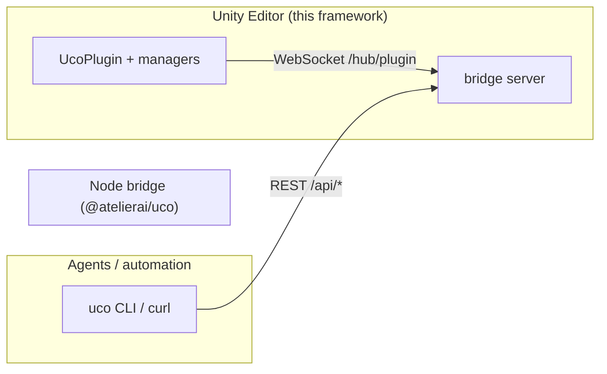

# Uco Framework

The C# plugin-side library for **Unity Copilot**: attribute-based tool/prompt/resource registration, the WebSocket hub client that connects the Unity Editor to the Node bridge, and the plugin builder that scans assemblies at startup.

Forked from [IvanMurzak/MCP-Plugin-dotnet](https://github.com/IvanMurzak/MCP-Plugin-dotnet) (upstream 6.3.2) under Apache-2.0; upstream notices are preserved in file headers. The fork permanently removed the upstream protocol layer — this tree speaks a raw-WebSocket hub protocol to the Node bridge and nothing else. It does not merge with upstream.

## What lives here

| Project | Purpose |
|---|---|
| `Uco.Framework` | Plugin runtime: `UcoPlugin`, `UcoPluginBuilder`, managers (`ToolManager`, `PromptManager`, `ResourceManager`, `SystemToolManager`, `PluginManager`), the hub client (`PluginManagerClientHub`), network connection providers |
| `Uco.Framework.Common` | Shared contracts: wire DTOs (`UcoClientData`, `UcoServerData`), RPC interfaces (`IClientRpc`, `IServerPluginManager`), `Consts` (hub path, headers, env names) |
| `Uco.Framework.Tests` | 831 tests (xunit, net8.0 + net9.0) |
| `../ReflectorNet` | Reflection/serialization helpers used for schema generation and fuzzy matching |

The DLLs are consumed by the Unity package (`uco-unity-project/Packages/com.atelierai.unity.copilot/Plugins/`) and rebuilt with `../commands/build-framework-dlls.ps1`.

## Architecture

The Node bridge is the process front door: REST in from agents, WebSocket out to plugin clients. The REST surface (endpoints, session gating, instance routing) is documented in the CLI repository, not here.

## Registration

- **Tools**: `[UcoPluginToolType]` on class, `[UcoPluginTool(Name = "category-action")]` on methods
- **Prompts**: `[UcoPluginPromptType]` / `[UcoPluginPrompt]`
- **Resources**: `[UcoPluginResourceType]` / `[UcoPluginResource]`
- Schema generation and fuzzy name matching are powered by ReflectorNet.

## Guarded registries (breaking change from upstream 6.3.2)

`ToolRunnerCollection` and `SystemToolRunnerCollection` implement `IDictionary<string, IRunTool>` / `IReadOnlyDictionary<string, IRunTool>` instead of inheriting `Dictionary<string, IRunTool>`. Every insertion route wraps the runner with the framework guard, and every retrieval exposes only the guarded runner. Invoke registered tools through `ToolManager` / `SystemToolManager`; direct runner execution is rejected by the guard. Do not assume either registry can be assigned, cast, or passed as the concrete `Dictionary` type.

## Wire contracts this tree owns

- Hub path and notification/method names: `Consts.Rpc`, `Consts.Uco` in `Uco.Framework.Common`
- Instance header: `X-Plugin-Instance-Id`
- Editor env vars: `UNITY_COPILOT_*` (read by the Unity package's `EnvironmentUtils`)
- Any rename here must be mirrored in the Node bridge (`cocli/src/server/`) in the same release.

## License

This project is licensed under the Apache-2.0 License. Copyright (c) Ivan Murzak (original upstream) — fork modifications copyright their respective authors. See `LICENSE` for the full text.
